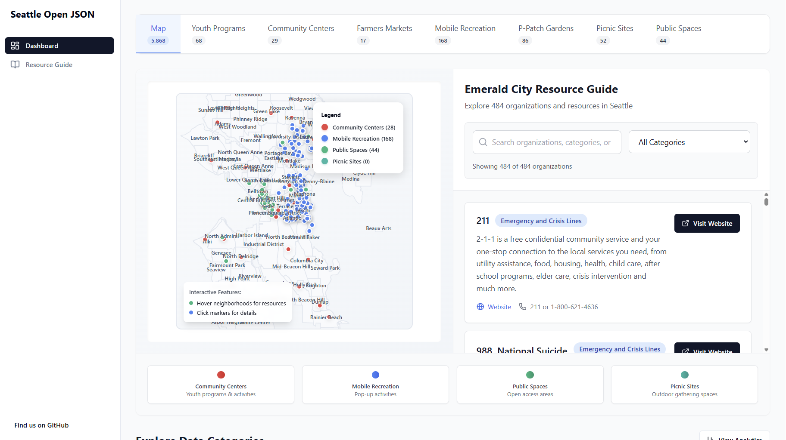

# Seattle Open JSON

🏙️ A community-driven, open-source collection of information about the government officies and services provided by the City of Seattle, and other government entities & civil society organization in the Puget Sound region.

## 📋 Overview

Seattle Open JSON provides structured, machine-readable information about youth initiatives, community resources, and recreational opportunities in the Seattle area. This package includes both raw data and TypeScript interfaces for type-safe development. If you fork this repository, you will notice a 'react-playground' directory; by running `npm install` and `npm run dev`, you can open visual playground to help explore the data we have collected thus far. It is incomplete, and not adequately cleaned up yet, but it is a starting point. I hope that the City of Seattle can take some inspiration towards forking this, or simply looking at it, and putting together their own npm module to enable developers to build on top of their data. In particular, creating a tree view of the structure of government, and it's available resources and programs, would allow developers to adequately present those resources to make them more discoverable to the general public.



## 🚀 NPM Package Installation

```bash
npm install seattle-open-json
```

## 📊 Data Collections

This package contains **12 datasets** with detailed information about Seattle's community resources and permit data, originally taken from the City of Seattle, the Emerald City Resource Guide, and scraped data from City of Seattle websites:

| Dataset                | Records  | Description                                                                              |
| ---------------------- | -------- | ---------------------------------------------------------------------------------------- |
| **Community Centers**  | 27+      | Seattle Parks & Recreation community centers with schedules, amenities, and contact info |
| **Farmers Markets**    | 20+      | Local farmers markets with locations, schedules, and vendor information                  |
| **Parks Catalog**      | 2,200+   | Complete catalog of Seattle parks with facilities and amenities                          |
| **Mobile Recreation**  | 150+     | Mobile recreation programming across Seattle neighborhoods                               |
| **P-Patch Gardens**    | 90+      | Community gardens with plot information and contact details                              |
| **Picnic Sites**       | 50+      | Reservable picnic areas with capacity and amenities                                      |
| **Public Spaces**      | 40+      | Privately-owned public spaces available for community use                                |
| **Youth Programs**     | 60+      | Comprehensive youth programs, activities, and opportunities                              |
| **Emerald City Guide** | 480+     | Community resources and services directory                                               |
| **Building Permits**   | 1,000+   | Building permit applications with project details, costs, and review timelines           |
| **Plan Comments**      | 100,000+ | Plan review comments and corrections from permit review process                          |
| **Plan Review**        | 800,000+ | Detailed plan review records with reviewer assignments and completion status             |

## 🌟 Seattle Civic Standard (SCS) - NEW in v1.2.0

This package now includes **all datasets migrated to the Seattle Civic Standard (SCS)** - a unified, simple format designed for civic data interoperability.

### What is SCS?

The Seattle Civic Standard provides a consistent interface for all civic entities with just **6 core fields**:

1. **id** - Unique identifier
2. **name** - What it's called
3. **type** - What kind of thing it is
4. **description** - What it is in plain English
5. **location** - Where it is (address and/or coordinates)
6. **contact** - How to get more information

Plus optional fields like `schedule`, `dates`, `cost`, `ageRange`, `accessibility`, and more.

### Why SCS?

- ✅ **Single interface** works across all Seattle civic data sources
- ✅ **Easy to use** - consistent structure, easy to filter and search
- ✅ **Map-ready** - coordinates included where available
- ✅ **Calendar-ready** - schedules standardized
- ✅ **TypeScript-first** - full type safety included

### Quick Start with SCS

```typescript
import { scsData } from "seattle-open-json";

// Access all 3,176 civic entities in a unified format
const allEntities = scsData.getAllEntities();

// Easy filtering - works the same way for ALL entity types
const freePrograms = allEntities.filter((entity) =>
  entity.cost?.toLowerCase().includes("free")
);

const teenActivities = allEntities.filter(
  (entity) =>
    entity.ageRange?.includes("13") || entity.ageRange?.includes("teen")
);
```

**All 3,176 entities** across 9 datasets are now available in SCS format, making it easy to search, filter, and use civic data consistently.

## 🔧 Usage

### Basic Import

```typescript
import seattleData from "seattle-open-json";

// Access all data
console.log(seattleData.data);

// Access specific collections
console.log(seattleData.data.communityCenters);
console.log(seattleData.data.youthPrograms);

// Access metadata
console.log(seattleData.metadata);
```

### Named Imports

```typescript
import {
  communityCenters,
  farmersMarkets,
  youthPrograms,
  packageMetadata,
} from "seattle-open-json";

// Use individual collections
const activeCenters = communityCenters.filter(
  (center) => center["Open Status"] === "Open"
);

const weekendMarkets = farmersMarkets.filter(
  (market) =>
    market.ACTIVEDAY.includes("Saturday") || market.ACTIVEDAY.includes("Sunday")
);
```

### Categorized Access

```typescript
import { recreationOpportunities, communityResources } from "seattle-open-json";

// Recreation-focused data (community centers, parks, mobile programming)
const recreationData = recreationOpportunities;

// Community resources (farmers markets, P-patches, youth programs, etc.)
const communityData = communityResources;
```

## 📝 TypeScript Support

All data includes full TypeScript type definitions for type-safe development. Import the `CivicEntity` interface for SCS data, or use the original type definitions for raw data.

## 🎯 Common Use Cases

### Finding Youth Programs by Age

```typescript
import { youth_programs } from "seattle-open-json";

const teenPrograms = youth_programs.filter(
  (program) =>
    program.ageRange.includes("13") ||
    program.ageRange.includes("teen") ||
    program.ageRange.includes("14-18")
);
```

### Finding Open Community Centers

```typescript
import { communityCenters } from "seattle-open-json";

const openCenters = communityCenters.filter(
  (center) => center["Open Status"] === "Open"
);

const centersWithGyms = communityCenters.filter(
  (center) => center["Gym"] === "Yes"
);
```

### Finding Weekend Activities

```typescript
import { farmersMarkets, mobileRecreationProgramming } from "seattle-open-json";

const weekendMarkets = farmersMarkets.filter(
  (market) =>
    market.ACTIVEDAY.toLowerCase().includes("saturday") ||
    market.ACTIVEDAY.toLowerCase().includes("sunday")
);

const weekendRecreation = mobileRecreationProgramming.filter(
  (program) =>
    program["Day of Week"].includes("Saturday") ||
    program["Day of Week"].includes("Sunday")
);
```

### Searching Community Resources

```typescript
import { emeraldCityResourceGuide } from "seattle-open-json";

const mentalHealthResources = emeraldCityResourceGuide.filter((resource) =>
  resource.categories.some(
    (category) =>
      category.toLowerCase().includes("mental health") ||
      category.toLowerCase().includes("counseling")
  )
);

const foodResources = emeraldCityResourceGuide.filter((resource) =>
  resource.categories.some(
    (category) =>
      category.toLowerCase().includes("food") ||
      category.toLowerCase().includes("nutrition")
  )
);
```

### Analyzing Building Permits

```typescript
import { buildingPermits, planComments } from "seattle-open-json";

// Find high-value residential projects
const highValueResidential = buildingPermits.filter(
  (permit) =>
    permit.PermitClassMapped === "Residential" && permit.EstProjectCost > 500000
);

// Find permits with many review cycles (complex projects)
const complexProjects = buildingPermits.filter(
  (permit) => permit.NumberReviewCycles > 3
);

// Get all comments for a specific permit
const permitComments = planComments.filter(
  (comment) => comment.PermitNum === "6974203-CN"
);
```

## 🗂️ Available Exports

### Seattle Civic Standard (SCS) Data ⭐

```typescript
import { scsData } from "seattle-open-json";

// Get all 3,176 entities in unified format
const allEntities = scsData.getAllEntities();

// Or access individual collections
const markets = scsData.farmersMarkets;
const centers = scsData.communityCenters;
const programs = scsData.youthPrograms;
```

### Original Data Collections

Access the raw data in its original format:

- `communityCenters` - Community centers with schedules and amenities
- `farmersMarkets` - Farmers markets with locations and schedules
- `parksCatalog` - Parks and recreation activities
- `mobileRecreationProgramming` - Mobile recreation programs
- `pPatch` - P-Patch community gardens
- `picnicSites` - Reservable picnic sites
- `privatelyOwnedPublicSpaces` - Public spaces (POPS)
- `youth_programs` - Youth programs and activities
- `emeraldCityResourceGuide` - Community resources directory
- `buildingPermits` - Building permit applications with project details
- `planComments` - Plan review comments and corrections
- `planReview` - Detailed plan review records

### Aggregated Collections

- `allSeattleData` - All datasets combined
- `recreationOpportunities` - Recreation-focused data
- `communityResources` - Community service data

### TypeScript Types

All interfaces are exported for type-safe development:

```typescript
import type {
  CivicEntity, // SCS standard interface
  YouthProgram,
  CommunityCenter,
  FarmersMarket,
  BuildingPermit, // Building permit data
  PlanComment, // Plan review comments
  PlanReview, // Plan review records
  // ... all other types
} from "seattle-open-json";
```

## 📈 Package Statistics

```typescript
import { packageMetadata } from "seattle-open-json";

console.log(packageMetadata.totalRecords);
// Total entities across all datasets
```

---

## 📚 Original Data Model Reference

For developers working with the raw data formats, here are the original TypeScript interfaces:

### Youth Programs

```typescript
interface YouthProgram {
  id: string;
  organizationName: string;
  programDescription: string;
  activityName: string;
  activityDescription: string;
  location: string;
  ageRange: string;
  dates: string;
  day: string;
  times: string;
  cost: string;
  url: string;
  lastUpdated: string;
}
```

### Community Centers

```typescript
interface CommunityCenter {
  OBJECTID: number;
  name: string;
  Address: string;
  "Short Name": string;
  "CC Phone Number": string;
  "Open Status": string;
  "Scheduling Season": string;
  // ... additional schedule and amenity fields
}
```

### Farmers Markets

```typescript
interface FarmersMarket {
  OBJECTID: number;
  NAME: string;
  LOCATION: string;
  ORGANIZATI: string;
  ACTIVEDAY: string;
  MONTHS: string;
  HOURS: string;
  WEBSITE: string;
  PHONE: string;
  x: number; // State Plane coordinates
  y: number; // State Plane coordinates
}
```

### Emerald City Resource Guide

```typescript
interface EmeraldCityResourceGuide {
  name: string;
  website?: string;
  phone?: string;
  address?: string;
  hours?: string;
  description: string;
  categories: string[];
}
```

> **Note:** For new applications, we recommend using the **Seattle Civic Standard (SCS)** format which provides a unified interface across all datasets.

---

## 🤝 Contributing

This is a community-driven project! We welcome contributions to:

- Add new data sources
- Improve data quality
- Enhance TypeScript definitions
- Add utility functions

## 📄 License

MIT License - see LICENSE file for details.

## 🔗 Links

- **Repository**: [https://github.com/mikhael28/seattle-open-json](https://github.com/mikhael28/seattle-open-json)
- **npm Package**: [https://www.npmjs.com/package/seattle-open-json](https://www.npmjs.com/package/seattle-open-json)

---

Built with ❤️ for the Seattle community by [Michael Nightingale](https://github.com/mikhael28)
