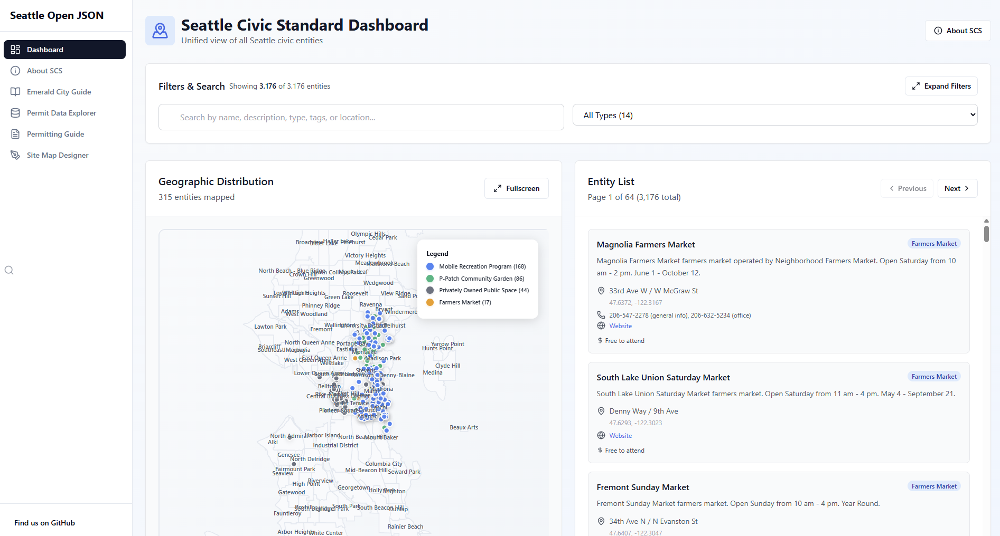
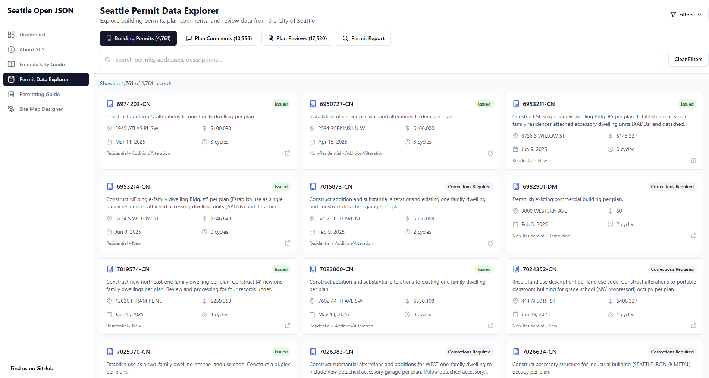

# Seattle Open JSON

🏙️ An open-source npm package & MCP server collecting information about government offices and services provided by the City of Seattle and other organizations in the Puget Sound region.

> **🤖 MCP Server Available**: See [`/mcp-server`](/mcp-server) for a ready-to-use Model Context Protocol server that exposes civic entity search, activity lookup, and permit data APIs for AI agents and applications.

## 📋 Overview

Seattle Open JSON provides structured, machine-readable information about youth initiatives, community resources, and recreational opportunities in the Seattle area. The package includes both raw data and TypeScript interfaces for type-safe development.

## 🎫 NEW: Seattle 311 / Customer Support Tickets

**7,100+ live service requests** from Seattle's Find It Fix It app and 311 system, now available in the **Seattle Civic Standard (SCS) CivicTicket format**. This represents a new pattern in civic data - dynamic work items with lifecycle tracking rather than static resources.

### Features
- ✅ **Full SCS Compliance**: Every ticket includes all 6 core CivicEntity fields plus ticket-specific metadata
- 📍 **Geocoded Locations**: Precise coordinates for mapping service requests across Seattle
- 🏢 **Department Information**: Routing and contact details for responsible city departments
- 🏘️ **Neighborhood Context**: Community reporting areas, council districts, and police precincts
- 🔖 **Rich Tagging**: Automatic tag generation for request types, status, method, and location

### Quick Start

```typescript
import { scsData } from 'seattle-open-json';

// Access all 7,100+ civic tickets in SCS format
const tickets = scsData.customerSupportTickets;

// Filter by status
const openTickets = tickets.filter(t => t.ticketStatus === 'Open');

// Filter by neighborhood
const fremontIssues = tickets.filter(t => t.neighborhood === 'FREMONT');

// Filter by department
const sdotRequests = tickets.filter(t => 
  t.assignedDepartment === 'SDOT-Seattle Department of Transportation'
);
```

### Data Structure

Each `CivicTicket` includes:
- **Core CivicEntity fields**: `id`, `name`, `type`, `description`, `location` (with coordinates), `contact`
- **Ticket-specific fields**: `ticketNumber`, `ticketStatus`, `createdDate`, `requestType`
- **Optional metadata**: `methodReceived`, `assignedDepartment`, `source`, `precinct`, `councilDistrict`
- **Categorization**: `tags`, `organization`, `neighborhood`, `notes`

### Top Service Request Types
1. Unauthorized Encampment (1,854 tickets)
2. Abandoned Vehicle/72hr Parking Ordinance (1,427)
3. Graffiti (666)
4. Illegal Dumping / Needles (614)
5. General Inquiry - Customer Service Bureau (457)

### Import Options

```typescript
// Import migrated SCS tickets
import { scsData } from 'seattle-open-json';
const civicTickets = scsData.customerSupportTickets;

// Import raw camelCase data
import { customerSupport } from 'seattle-open-json/customer-support';

// Import types
import type { CustomerSupportTicket, CivicTicket } from 'seattle-open-json';

// Import migration function
import { migrateCustomerSupportTicket } from 'seattle-open-json/migrations/customer-support';
```




## 🚀 Installation

```bash
npm install seattle-open-json
```

### 🌲 Tree-Shaking Support (v1.4.0+)

The package now supports tree-shaking for optimal bundle sizes. Import only the data you need:

```typescript
// ✅ RECOMMENDED: Import specific datasets (tree-shakeable)
import { communityCenters } from 'seattle-open-json/community-centers';
import { youthPrograms } from 'seattle-open-json/youth-programs';

// ✅ RECOMMENDED: Lazy-load SCS data when needed
import { loadScsData } from 'seattle-open-json/scs';
const scsData = await loadScsData();

// ⚠️ AVOID: Importing from main entry loads all data
import seattleData from 'seattle-open-json'; // Loads 40MB+ of data!
```

### Available Submodule Imports

| Import Path | Description | Size |
|-------------|-------------|------|
| `seattle-open-json/types` | TypeScript types only | ~0KB |
| `seattle-open-json/community-centers` | Community centers data | ~81KB |
| `seattle-open-json/farmers-markets` | Farmers markets | ~7KB |
| `seattle-open-json/parks-catalog` | Parks catalog | ~3.6MB |
| `seattle-open-json/youth-programs` | Youth programs | ~51KB |
| `seattle-open-json/customer-support` | Customer support tickets | ~4.4MB |
| `seattle-open-json/scs` | Lazy-loaded SCS data | On-demand |

### 🌲 Tree-Shaking Support (v1.4.0+)

The package now supports tree-shaking for optimal bundle sizes. Import only the data you need:

```typescript
// ✅ RECOMMENDED: Import specific datasets (tree-shakeable)
import { communityCenters } from 'seattle-open-json/community-centers';
import { youthPrograms } from 'seattle-open-json/youth-programs';

// ✅ RECOMMENDED: Lazy-load SCS data when needed
import { loadScsData } from 'seattle-open-json/scs';
const scsData = await loadScsData();

// ⚠️ AVOID: Importing from main entry loads all data
import seattleData from 'seattle-open-json'; // Loads 40MB+ of data!
```

### Available Submodule Imports

| Import Path | Description | Size |
|-------------|-------------|------|
| `seattle-open-json/types` | TypeScript types only | ~0KB |
| `seattle-open-json/community-centers` | Community centers data | ~81KB |
| `seattle-open-json/farmers-markets` | Farmers markets | ~7KB |
| `seattle-open-json/parks-catalog` | Parks catalog | ~3.6MB |
| `seattle-open-json/youth-programs` | Youth programs | ~51KB |
| `seattle-open-json/customer-support` | Customer support tickets | ~4.4MB |
| `seattle-open-json/scs` | Lazy-loaded SCS data | On-demand |

For instructions about the MCP server, please refer to the README in the `mcp-server` folder.

## 📊 Data Collections

**13 datasets** with detailed information about Seattle's community resources, permit data, and service requests:

| Dataset                | Records  | Description                                                                              |
| ---------------------- | -------- | ---------------------------------------------------------------------------------------- |
| **Community Centers**  | 27+      | Seattle Parks & Recreation community centers with schedules, amenities, and contact info |
| **Farmers Markets**    | 20+      | Local farmers markets with locations, schedules, and vendor information                  |
| **Parks Catalog**      | 2,200+   | Complete catalog of Seattle parks with facilities and amenities                          |
| **Mobile Recreation**  | 150+     | Mobile recreation programming across Seattle neighborhoods                               |
| **P-Patch Gardens**    | 90+      | Community gardens with plot information and contact details                              |
| **Picnic Sites**       | 50+      | Reservable picnic areas with capacity and amenities                                      |
| **Public Spaces**      | 40+      | Privately-owned public spaces available for community use                                |
| **Youth Programs**     | 60+      | Comprehensive youth programs, activities, and opportunities                              |
| **Emerald City Guide** | 480+     | Community resources and services directory                                               |
| **Building Permits**   | 1,000+   | Building permit applications with project details, costs, and review timelines           |
| **Plan Comments**      | 100,000+ | Plan review comments and corrections from permit review process                          |
| **Plan Review**        | 800,000+ | Detailed plan review records with reviewer assignments and completion status             |
| **Civic Tickets**      | 7,100+   | Seattle 311/Find It Fix It service requests with status tracking and location data       |

## 🌟 Seattle Civic Standard (SCS)

All datasets are available in the **Seattle Civic Standard** format - a unified interface for civic data with 6 core fields:

1. **id** - Unique identifier
2. **name** - Entity name
3. **type** - Entity category
4. **description** - Plain language description
5. **location** - Address and/or coordinates
6. **contact** - Contact information

Plus optional fields like `schedule`, `dates`, `cost`, `ageRange`, `accessibility`, and more.

### Quick Start

```typescript
import { scsData } from "seattle-open-json";

// Access all 3,176+ civic entities in unified format
const allEntities = scsData.getAllEntities();

// Filter by cost
const freePrograms = allEntities.filter((entity) =>
  entity.cost?.toLowerCase().includes("free")
);

// Filter by age
const teenActivities = allEntities.filter(
  (entity) =>
    entity.ageRange?.includes("13") || entity.ageRange?.includes("teen")
);
```

## 🔧 Usage Examples

### Tree-Shakeable Imports (Recommended)

```typescript
// Import only the datasets you need - optimal bundle size
import { communityCenters } from "seattle-open-json/community-centers";
import { farmersMarkets } from "seattle-open-json/farmers-markets";
import { youthPrograms } from "seattle-open-json/youth-programs";

const activeCenters = communityCenters.filter(
  (center) => center["Open Status"] === "Open"
);
```

### Lazy-Loading SCS Data

```typescript
import { loadScsData } from "seattle-open-json/scs";

// Load data only when needed
const scsData = await loadScsData();
const freePrograms = scsData.getAllEntities()
  .filter(entity => entity.cost?.toLowerCase().includes("free"));
```

### Legacy Import (Not Recommended)

```typescript
// ⚠️ This imports ALL data (40MB+) - avoid in production
import seattleData from "seattle-open-json";
```

### Finding Youth Programs by Age

```typescript
import { youth_programs } from "seattle-open-json/youth-programs";

const teenPrograms = youth_programs.filter(
  (program) =>
    program.ageRange.includes("13") || program.ageRange.includes("teen")
);
```

### Analyzing Building Permits

```typescript
import { buildingPermits } from "seattle-open-json/building-permits";

const highValueResidential = buildingPermits.filter(
  (permit) =>
    permit.PermitClassMapped === "Residential" && permit.EstProjectCost > 500000
);
```

### Tracking 311 Service Requests

```typescript
import { scsData } from "seattle-open-json";

// Get all civic tickets in SCS format
const tickets = scsData.customerSupportTickets;

// Find all open graffiti reports in a specific neighborhood
const graffitiReports = tickets.filter(
  (ticket) =>
    ticket.requestType === "Graffiti" &&
    ticket.ticketStatus === "Open" &&
    ticket.neighborhood === "CAPITOL HILL"
);

// Map all service requests with coordinates
const mappableTickets = tickets.filter(
  (ticket) => typeof ticket.location === "object" && ticket.location.coordinates
);
```

## 🗂️ Available Exports

### SCS Data Collections

```typescript
import { scsData } from "seattle-open-json";

const allEntities = scsData.getAllEntities();
const markets = scsData.farmersMarkets;
const centers = scsData.communityCenters;
```

### Original Data Collections

- `communityCenters`, `farmersMarkets`, `parksCatalog`, `mobileRecreationProgramming`
- `pPatch`, `picnicSites`, `privatelyOwnedPublicSpaces`, `youth_programs`
- `emeraldCityResourceGuide`, `buildingPermits`, `planComments`, `planReview`
- `customerSupport` - Raw customer support tickets in camelCase format

### TypeScript Types

```typescript
import type {
  CivicEntity,
  CivicTicket,
  YouthProgram,
  CommunityCenter,
  BuildingPermit,
  PlanComment,
  CustomerSupportTicket,
} from "seattle-open-json";
```

## 📈 Package Statistics

```typescript
import { packageMetadata } from "seattle-open-json";
console.log(packageMetadata.totalRecords);
```

## 🤖 MCP Server

The `/mcp-server` directory contains an Express + TypeScript implementation that exposes three MCP tools for AI agents:

- **`searchCivicEntities`** - Query civic entities by type, tag, neighborhood, or keyword
- **`searchActivities`** - Search activities across parks, mobile recreation, and youth programs
- **`getPermitDetails`** - Fetch permit records with plan comments and review cycles

See the [MCP Server README](/mcp-server/README.md) for setup and API documentation.

## 🤝 Contributing

This is a community-driven project! We welcome contributions to add new data sources, improve data quality, and enhance TypeScript definitions.

## 📄 License

MIT License - see LICENSE file for details.

## 🔗 Links

- **Repository**: [https://github.com/mikhael28/seattle-open-json](https://github.com/mikhael28/seattle-open-json)
- **npm Package**: [https://www.npmjs.com/package/seattle-open-json](https://www.npmjs.com/package/seattle-open-json)

---

Built with ❤️ for the Seattle community by [Michael Nightingale](https://github.com/mikhael28)
